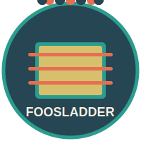

# FoosLadder - Foosball Score Tracking App



FoosLadder is a modern, clean, and responsive Next.js application designed to track foosball scores, player ELO ratings, and game history. It's built with TypeScript, Tailwind CSS, and Supabase for a robust and enjoyable user experience.

## Features

- **Score Tracking**: Easily add new game results, supporting both 1v1 and 2v2 matches with explicit team assignments (Red vs. Blue).
- **ELO Rating System**: Automatically calculates and updates player ELO ratings after each game.
- **Player Statistics**: View individual player statistics, including ELO history, win/loss records, and win rates.
- **ELO History Charts**: Visualize player ELO progression over time with interactive charts.
- **Leaderboard**: See a ranked list of all players by their current ELO.
- **Last Games**: Quickly view a list of recently played games with scores and participants.
- **Modern UI/UX**: Clean, responsive design built with Tailwind CSS and a custom color palette, ensuring a great experience on both desktop and mobile devices.
- **Password Protection**: A simple login page protects access to the app.
- **Supabase Backend**: All data (players, games) is stored in a Supabase PostgreSQL database, ensuring data persistence and reliability.
- **TypeScript First**: Developed with TypeScript for improved code quality and maintainability.
- **Cloudflare Tunnel Integration**: Exposes the local development server to the internet via Cloudflare Tunnel for easy sharing and testing.

## Tech Stack

- **Framework**: [Next.js](https://nextjs.org/) (v15+ with App Router)
- **Language**: [TypeScript](https://www.typescriptlang.org/)
- **Styling**: [Tailwind CSS](https://tailwindcss.com/) (v4+) with a custom color palette
- **Database**: [Supabase](https://supabase.io/) (PostgreSQL)
- **Charting**: [Chart.js](https://www.chartjs.org/) with `react-chartjs-2`
- **Deployment**: Docker, Docker Compose, Cloudflare Tunnel
- **UI Components**: Custom-built React functional components with Hooks
- **Linting/Formatting**: ESLint & Prettier (assumed setup)

## Getting Started

### Prerequisites

- Node.js (v18 or later recommended)
- npm, yarn, or pnpm
- A Supabase account and project

### Setup

1. **Clone the repository:**

   ```bash
   git clone https://your-repository-url/foosladder.git
   cd foosladder
   ```

2. **Install dependencies:**

   ```bash
   npm install
   # or
   # yarn install
   # or
   # pnpm install
   ```

3. **Set up Supabase:**
   - Create a new project on [Supabase](https://supabase.io/).
   - In your Supabase project, go to the SQL Editor and run the schema defined in `supabase_schema.sql` to create the necessary tables (`players`, `games`, `game_participants`).
   - In your Supabase project settings, find your API URL and `anon` key.

4. **Configure Environment Variables:**
   - Create a `.env.local` file in the root of the project by copying `.env.example`.
   - Add your Supabase credentials, a password for the login page, and your Cloudflare Tunnel token:

     ```env
     NEXT_PUBLIC_SUPABASE_URL=your_supabase_project_url
     NEXT_PUBLIC_SUPABASE_ANON_KEY=your_supabase_anon_key
     NEXT_PUBLIC_FOOSBALL_PASSWORD=your_chosen_password
     CLOUDFLARED_TUNNEL_TOKEN=your_cloudflared_tunnel_token
     ```

5. **Run the development server:**

   ```bash
   npm run dev
   ```

6. Open [http://localhost:3000](http://localhost:3000) with your browser to see the application.

### Building for Production

```bash
npm run build
```

### Starting the Production Server

```bash
npm run start
```

## Running with Docker

You can run FoosLadder using Docker or Docker Compose for easy deployment.

**Requirements:**

- [Docker](https://www.docker.com/get-started) installed
- (Optional) [Docker Compose](https://docs.docker.com/compose/) for multi-container management
- A `.env` file in the project root with your Supabase credentials, app password and Cloudflare Tunnel token, or set the environment variables directly

### 1. Build and Run with Docker (Standalone)

```sh
# Build the Docker image
docker build -t foosladder .

# Run the container (make sure to set environment variables or mount your .env.local)
docker run -p 3000:3000 \
  -e NEXT_PUBLIC_SUPABASE_URL=your_supabase_project_url \
  -e NEXT_PUBLIC_SUPABASE_ANON_KEY=your_supabase_anon_key \
  -e NEXT_PUBLIC_FOOSBALL_PASSWORD=your_chosen_password \
  foosladder
```

### 2. Run with Docker Compose

1. Ensure your `.env` file is present in the project root (you can copy `.env.example` and fill in the values).
2. Start the app and the Cloudflare Tunnel:

```sh
docker compose up --build
```

The app will be available at [http://localhost:3000](http://localhost:3000) and also accessible via the Cloudflare Tunnel URL provided in the `cloudflared` service logs.

> **Note:**
>
> - The `foosladder` container expects the following environment variables: `NEXT_PUBLIC_SUPABASE_URL`, `NEXT_PUBLIC_SUPABASE_ANON_KEY`, and `NEXT_PUBLIC_FOOSBALL_PASSWORD`.
> - The `cloudflared` container expects the `CLOUDFLARED_TUNNEL_TOKEN` environment variable.
> - The default exposed port for the FoosLadder app is `3000`. You can change the host port in `docker-compose.yml` if needed (though the primary access when using the tunnel will be through the Cloudflare URL).

## Project Structure

- `app/`: Contains all the Next.js pages, components, and core application logic.
  - `AddGameForm.tsx`: Component for submitting new game results.
  - `AddPlayerForm.tsx`: Component for adding new players.
  - `LastGames.tsx`: Component to display a list of recent games.
  - `Leaderboard.tsx`: Component to display player rankings.
  - `PlayerEloChart.tsx`: Component for rendering ELO history charts.
  - `PlayerStatsPanel.tsx`: Component to show detailed player statistics.
  - `PasswordGate.tsx`: Component for the login page.
  - `foosballData.ts`: Contains functions for interacting with the Supabase database (fetching/adding players and games, ELO calculation).
  - `foosballTypes.ts`: Defines TypeScript types for players, games, etc.
  - `playerStats.ts`: Logic for calculating derived player statistics.
  - `supabaseClient.ts`: Initializes the Supabase client.
  - `page.tsx`: The main page of the application.
  - `layout.tsx`: The main layout component, including metadata and favicon.
  - `globals.css`: Global styles and Tailwind CSS imports.
- `public/`: Static assets, including the logo and favicon.
  - `foosball-logo.svg`: The main application logo.
  - `foosball-favicon.svg`: The application favicon.
- `supabase_schema.sql`: SQL schema for the Supabase database tables.
- `tailwind.config.js`: Configuration for Tailwind CSS, including the custom color palette.
- `next.config.ts`, `tsconfig.json`, etc.: Standard Next.js and TypeScript configuration files.
- `docker-compose.yml`: Defines the services for running the application and Cloudflare Tunnel with Docker Compose.
- `Dockerfile`: Instructions for building the FoosLadder application Docker image.
- `.env.example`: Example environment file.

## Color Palette

The application uses a custom color palette defined in `tailwind.config.js`:

- **Charcoal**: `#264653` (Dark base, backgrounds)
- **Persian Green**: `#2A9D8F` (Primary accent, interactive elements)
- **Saffron**: `#E9C46A` (Secondary accent, highlights)
- **Sandy Brown**: `#F4A261` (Tertiary accent)
- **Burnt Sienna**: `#E76F51` (Accent for warnings/errors)

## Contributing

Contributions are welcome! If you have suggestions or want to improve FoosLadder, please feel free to open an issue or submit a pull request.

## License

This project is open-source and available under the MIT License.

---

_This README was last updated on May 21, 2025._
